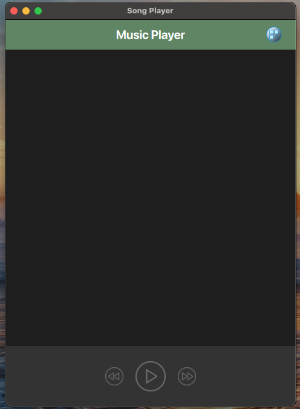
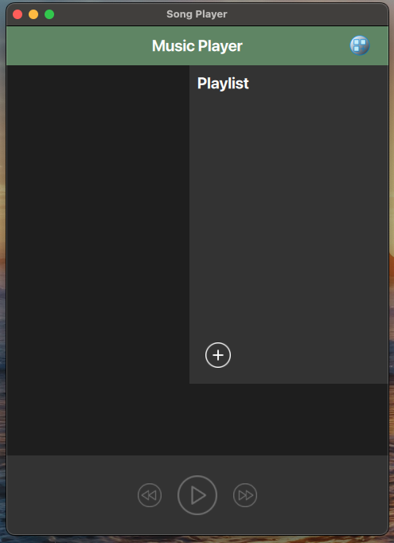
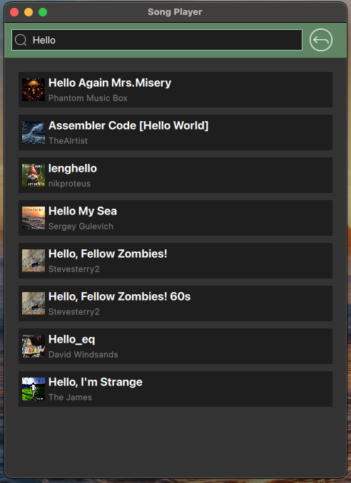
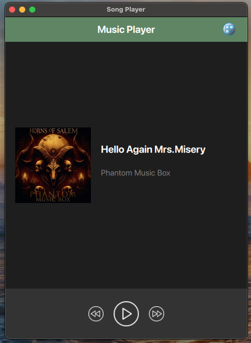
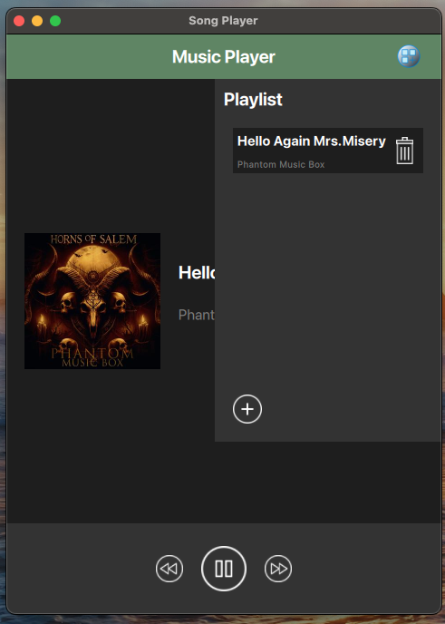
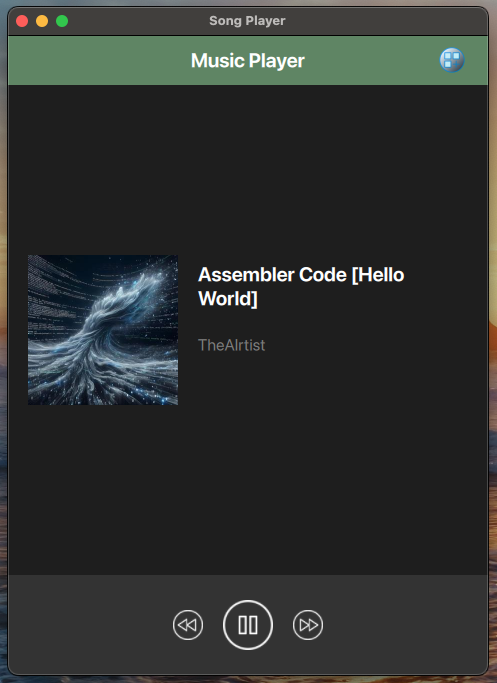
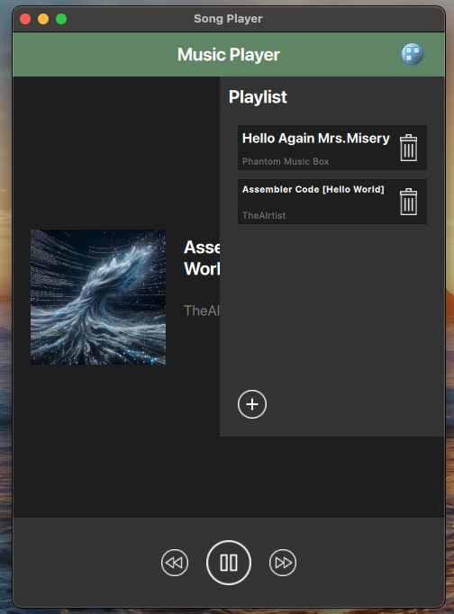

# MusicPlayer

## Introduction

> MusicPlayer is a versatile and user-friendly application designed to play and manage your music library. This application leverages the power of QML for smooth rendering and intuitive UI implementation, alongside C++ for robust backend operations and API requests.

---

## Features

- **Smooth UI Rendering**: Utilizes QML for a responsive and visually appealing user interface.
- **Backend Functionality**: Powered by C++ for efficient data handling and processing.
- **API Integration**: Connects to the Jamendo API to search for and retrieve song information, including images and videos.
- **Playlist Management**: Create, edit, and delete playlists.
- **Search Functionality**: Quickly find songs by name.
- **Playback Controls**: Play, pause, skip, and navigate through your music library with ease.
- **Media Display**: Loads and displays images and videos provided by the API.

---

## Previews

- Home 
- Empty Playlist 
- Search 
- Music Player 1 
- Playlist with 1 item 
- Music Player 2 
- Playlist with 2 items 

---

- **Reference [click me](https://github.com/scytheStudio/qt-qml-tutorial)**
